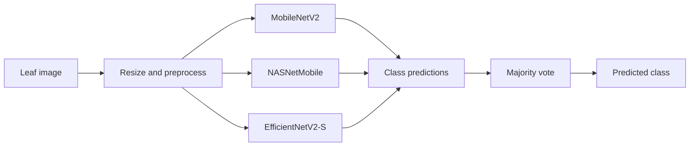

# Betel Leaf Disease Classification

**Transfer learning · Computer vision · Model evaluation**

An image-classification project exploring three pretrained CNN architectures and a majority-voting ensemble for betel leaf images.

[Demo video](YOUR_VIDEO_URL) · [Report an issue](../../issues) · [Project structure](#project-structure)


</div>

---

## At a glance

This project explores classifying betel leaf images into three categories using transfer learning. The original notebook experiments with **MobileNetV2**, **NASNetMobile**, and **EfficientNetV2-S**, then combines their outputs using majority voting.

**Current scope:** saved-model inference utilities, an evaluation helper, and a documented route to reproduce predictions without retraining. The model files and dataset are not bundled in this repository.

> **Reproducibility note:** this repository is a cleaned portfolio starter based on the original notebook. The saved model artifacts and dataset were not supplied with the source code, so end-to-end inference and final metrics must be verified in the target environment. Do not treat placeholder metrics as results.

## Demo

**[▶ Watch the project demonstration](YOUR_VIDEO_URL)**

Add a real screenshot to `assets/demo-thumbnail.png`, then optionally use a clickable thumbnail:

```markdown
[](YOUR_VIDEO_URL)
```

Suggested demo flow (60–90 seconds):
1. Introduce the classification task and supported classes.
2. Select a leaf image and show the prediction.
3. Show the individual model outputs and ensemble decision.
4. Briefly show measured evaluation results and known limitations.

## Problem and approach

Image-based plant disease classification is a useful computer-vision task, but a model's performance depends on data quality, input preprocessing, and evaluation design. This project investigates pretrained feature extractors as a starting point for betel leaf classification.



## Models and tooling

| Area | Implementation |
|---|---|
| Language | Python |
| Deep learning | TensorFlow / Keras |
| Architectures | MobileNetV2, NASNetMobile, EfficientNetV2-S |
| Image handling | Keras image utilities |
| Evaluation | scikit-learn |
| Visualizations | Matplotlib, Seaborn |
| Original development environment | Google Colab |

## Repository structure

```text
.
├── .github/workflows/tests.yml
├── assets/                 # Demo thumbnail and project screenshots
├── models/                 # Instructions only; model weights stay out of Git
├── notebooks/              # Cleaned notebook, if published
├── src/
│   ├── ensemble_inference.py
│   └── evaluate_existing_generator.py
├── tests/
│   └── test_ensemble_logic.py
├── README.md
├── requirements.txt
└── .gitignore
```

## Quick start

Use Python 3.10 or 3.11, create a virtual environment, and install the dependencies:

```bash
python -m venv .venv
```

Windows:

```powershell
.venv\Scripts\activate
```

macOS/Linux:

```bash
source .venv/bin/activate
```

Then:

```bash
pip install -r requirements.txt
```

## Run inference with existing model files

Place your existing saved models somewhere outside Git. The expected model artifacts from the original notebook are:

- `final_effnetv2.h5`
- `final_nasnet.h5`
- `mobilenet_model.h5`

Run:

```bash
python -m src.ensemble_inference \
  --image path/to/leaf.jpg \
  --classes Healthy_Leaf Leaf_Rot Leaf_Spot \
  --effnet path/to/final_effnetv2.h5 \
  --nasnet path/to/final_nasnet.h5 \
  --mobilenet path/to/mobilenet_model.h5
```

The class names and their order must match the class-index order used during training. Change the example class names if the actual dataset folder names differ.

### Preprocessing compatibility warning

The original notebook's custom image generator divides pixel values by `255`. The EfficientNetV2-S builder also enables Keras built-in preprocessing. Whether that is compatible depends on the exact TensorFlow/Keras version and the model's training input pipeline. The inference utility follows the original generator's scaling by default; **verify preprocessing against the saved model before trusting its predictions**. Do not change preprocessing merely to make a prediction look better.

## Evaluation and reporting

The evaluation helper supports a fresh, non-shuffled generator that yields `(images, one_hot_labels)` or `(images, one_hot_labels, sample_weights)`. It uses a ceiling-based batch count and trims the final batch to the requested sample count.

Example integration in the original notebook:

```python
from src.evaluate_existing_generator import evaluate_model_on_generator

# Create a NEW test generator for each model. Use shuffle=False.
test_gen = custom_generator(
    X_test, y_test, classes, BATCH_SIZE,
    test_datagen, IMG_SIZE, shuffle=False
)

metrics = evaluate_model_on_generator(
    model=effnet_model,
    generator=test_gen,
    num_samples=len(X_test),
    batch_size=BATCH_SIZE,
    class_names=classes,
)

print("Test accuracy:", metrics["accuracy"])
print(metrics["classification_report"])
print(metrics["confusion_matrix"])
```

Evaluate every model on the same held-out images, using the correct preprocessing for that model. If augmented copies of the same source image appear across training and test splits, the evaluation may be contaminated; a source-image-level split is needed to address that.

### Results

**Populate this table only after running the corrected evaluation pipeline.** The values below are intentionally placeholders.

| Model | Test accuracy | Macro F1 | Weighted F1 |
|---|---:|---:|---:|
| MobileNetV2 | TBD | TBD | TBD |
| NASNetMobile | TBD | TBD | TBD |
| EfficientNetV2-S | TBD | TBD | TBD |
| Majority-voting ensemble | TBD | TBD | TBD |

Include the dataset citation, split strategy, sample counts, library versions, and the evaluation date alongside the final metrics. Do not use manually constructed confusion matrices or training accuracy as test results.

## Engineering decisions

- **No retraining required for inference fixes:** the inference module loads saved models and predicts without calling `fit`.
- **No model weights committed:** large artifacts are excluded to keep the repository lean and avoid redistributing data without permission.
- **Explicit class mapping:** class order is supplied by the caller to avoid silently guessing the label mapping.
- **Honest evaluation:** metrics are left as `TBD` until they are generated from verified held-out samples.

## Limitations and responsible use

- This is an educational/portfolio prototype, not a validated agricultural diagnostic system.
- Model output scores are not necessarily calibrated probabilities.
- Field images may differ from the training dataset.
- Dataset provenance, duplicate images, class mapping, and preprocessing can materially affect the results.
- Predictions should be verified by an agricultural expert before treatment decisions.

## Roadmap

- [ ] Verify inference with the existing saved model files
- [ ] Confirm class mapping and preprocessing for each architecture
- [ ] Re-run evaluation on a verified held-out split
- [ ] Add real demo screenshots and video link
- [ ] Add a small web interface or prediction API
- [ ] Add model-loading smoke tests and versioned model metadata
- [ ] Evaluate on independently collected field images

## Author

**Esha Banerjee** · Computer Vision · Deep Learning · Software Engineering

- GitHub: `YOUR_GITHUB_PROFILE`
- LinkedIn: `YOUR_LINKEDIN_PROFILE`

---

*Dataset and model artifacts should be cited and shared only in accordance with their original licenses and permissions.*
''',
"src/__init__.py": "",
"src/ensemble_inference.py": r'''"""Run inference with existing Keras models; this module does not train models."""
from __future__ import annotations

import argparse
from pathlib import Path
from typing import Sequence

import numpy as np
import tensorflow as tf
from tensorflow.keras.preprocessing.image import img_to_array, load_img


def load_image(image_path: str | Path, target_size=(224, 224), scale_01=True):
    """Load one RGB image using the original notebook's resize/scaling pipeline."""
    image = load_img(image_path, target_size=target_size, color_mode="rgb")
    array = img_to_array(image).astype("float32")
    if scale_01:
        array /= 255.0
    return np.expand_dims(array, axis=0)


def predict_ensemble(
    models: Sequence[tf.keras.Model],
    class_names: Sequence[str],
    image_path: str | Path,
    target_size=(224, 224),
    scale_01=True,
):
    """Predict with each model and combine class IDs by majority vote.

    Ties are resolved using the mean of model output vectors, restricted to
    tied classes. These outputs are scores, not calibrated probabilities.
    """
    if not models:
        raise ValueError("At least one loaded model is required.")
    if not class_names:
        raise ValueError("class_names cannot be empty.")

    batch = load_image(image_path, target_size=target_size, scale_01=scale_01)
    per_model_scores = []
    per_model_indices = []

    for model in models:
        scores = np.asarray(model.predict(batch, verbose=0))[0]
        if scores.ndim != 1 or len(scores) != len(class_names):
            raise ValueError(
                f"Model {model.name!r} returned {len(scores)} outputs, "
                f"but there are {len(class_names)} class names."
            )
        per_model_scores.append(scores)
        per_model_indices.append(int(np.argmax(scores)))

    mean_scores = np.mean(np.stack(per_model_scores), axis=0)
    vote_counts = np.bincount(per_model_indices, minlength=len(class_names))
    tied = np.flatnonzero(vote_counts == vote_counts.max())
    winner = int(tied[np.argmax(mean_scores[tied])])

    return {
        "predicted_class": class_names[winner],
        "class_index": winner,
        "vote_fraction": float(vote_counts[winner] / len(models)),
        "mean_model_scores": {
            name: float(score) for name, score in zip(class_names, mean_scores)
        },
        "individual_predictions": [
            {
                "model": model.name,
                "class": class_names[index],
                "score": float(per_model_scores[i][index]),
            }
            for i, (model, index) in enumerate(zip(models, per_model_indices))
        ],
    }


def main():
    parser = argparse.ArgumentParser(description=__doc__)
    parser.add_argument("--image", required=True)
    parser.add_argument("--classes", nargs="+", required=True)
    parser.add_argument("--effnet", required=True)
    parser.add_argument("--nasnet", required=True)
    parser.add_argument("--mobilenet", required=True)
    parser.add_argument(
        "--raw-0-255", action="store_true",
        help="Skip /255 scaling only if this matches the model's training pipeline."
    )
    args = parser.parse_args()

    paths = [args.effnet, args.nasnet, args.mobilenet]
    models = [tf.keras.models.load_model(path, compile=False) for path in paths]
    result = predict_ensemble(
        models=models,
        class_names=args.classes,
        image_path=args.image,
        scale_01=not args.raw_0_255,
    )

    print(f"\nEnsemble prediction: {result['predicted_class']}")
    print(f"Voting fraction: {result['vote_fraction']:.1%}")
    print("\nIndividual model predictions:")
    for item in result["individual_predictions"]:
        print(f"- {item['model']}: {item['class']} (score={item['score']:.4f})")
    print("\nMean model output scores:")
    for name, score in result["mean_model_scores"].items():
        print(f"- {name}: {score:.4f}")


if __name__ == "__main__":
    main()
''',
"src/evaluate_existing_generator.py": r'''"""Evaluation helper for an existing deterministic test generator."""
from __future__ import annotations

import math
import numpy as np
from sklearn.metrics import accuracy_score, classification_report, confusion_matrix


def evaluate_model_on_generator(
    model,
    generator,
    num_samples: int,
    batch_size: int,
    class_names,
):
    """Evaluate exactly num_samples from a fresh generator with shuffle=False.

    The generator must yield (images, one_hot_labels) or
    (images, one_hot_labels, sample_weights). Recreate it before calling if it
    has already been consumed. It must not silently skip samples.
    """
    if num_samples <= 0:
        raise ValueError("num_samples must be positive.")
    if batch_size <= 0:
        raise ValueError("batch_size must be positive.")

    steps = math.ceil(num_samples / batch_size)
    true_ids, pred_ids = [], []
    collected = 0

    for _ in range(steps):
        images, labels = next(generator)[:2]
        remaining = num_samples - collected
        if remaining <= 0:
            break
        images, labels = images[:remaining], labels[:remaining]
        scores = model.predict(images, verbose=0)
        true_ids.extend(np.argmax(labels, axis=1).tolist())
        pred_ids.extend(np.argmax(scores, axis=1).tolist())
        collected += len(images)

    if collected != num_samples:
        raise RuntimeError(
            f"Generator yielded {collected} samples, expected {num_samples}. "
            "Check generator length and corrupt-image handling."
        )

    label_ids = list(range(len(class_names)))
    report = classification_report(
        true_ids, pred_ids, labels=label_ids, target_names=list(class_names),
        output_dict=True, zero_division=0
    )
    return {
        "num_samples": collected,
        "accuracy": float(accuracy_score(true_ids, pred_ids)),
        "classification_report": report,
        "confusion_matrix": confusion_matrix(
            true_ids, pred_ids, labels=label_ids
        ).tolist(),
        "y_true": true_ids,
        "y_pred": pred_ids,
    }
''',
"tests/test_ensemble_logic.py": r'''"""Unit tests for majority-vote winner and tie-breaking logic."""
import unittest
import numpy as np


def choose_winner(votes, mean_scores, num_classes):
    counts = np.bincount(votes, minlength=num_classes)
    tied = np.flatnonzero(counts == counts.max())
    return int(tied[np.argmax(np.asarray(mean_scores)[tied])])


class EnsembleLogicTests(unittest.TestCase):
    def test_majority_wins(self):
        self.assertEqual(choose_winner([1, 1, 0], [0.2, 0.7, 0.1], 3), 1)

    def test_tie_uses_mean_score(self):
        self.assertEqual(choose_winner([0, 1, 2], [0.2, 0.6, 0.2], 3), 1)

    def test_single_class_tie_is_stable(self):
        self.assertEqual(choose_winner([0, 1], [0.9, 0.1], 2), 0)


if __name__ == "__main__":
    unittest.main()
''',
"requirements.txt": """tensorflow>=2.12
numpy>=1.23
scikit-learn>=1.2
Pillow>=9.0
""",
".gitignore": """__pycache__/
*.py[cod]
.venv/
venv/
.env
.ipynb_checkpoints/
.DS_Store

# Keep datasets and model artifacts out of Git unless explicitly authorized.
data/
datasets/
models/*.h5
models/*.keras
models/*.weights.h5
*.tflite

# Generated outputs
outputs/
*.log
""",
"models/README.md": """# Model artifacts

Place the trained Keras model files locally and pass their paths to `src/ensemble_inference.py`.

Expected artifacts from the original notebook:
- `final_effnetv2.h5`
- `final_nasnet.h5`
- `mobilenet_model.h5`

These files are intentionally excluded from Git. Do not redistribute model weights or dataset images without checking the original terms. Verify each model's input preprocessing and class order before comparing outputs.
""",
"assets/README.md": """# Assets

Add genuine screenshots and a demo thumbnail here. If using the README's thumbnail example, name the image `demo-thumbnail.png`. Only include images you have permission to publish.""",
"notebooks/README.md": """# Notebooks

If publishing a cleaned notebook, remove personal Google Drive paths, credentials, sensitive data, and large output cells. Make sure opening/running it does not unintentionally start a long training run.""",
".github/workflows/tests.yml": r'''name: Tests

on:
  push:
  pull_request:

jobs:
  unit-tests:
    runs-on: ubuntu-latest
    steps:
      - name: Check out repository
        uses: actions/checkout@v4
      - name: Set up Python
        uses: actions/setup-python@v5
        with:
          python-version: "3.11"
      - name: Install test dependencies
        run: python -m pip install --upgrade pip numpy
      - name: Run unit tests
        run: python -m unittest discover -s tests -v
'''
}

for rel, content in content_map.items():
    path = os.path.join(root, rel)
    os.makedirs(os.path.dirname(path), exist_ok=True)
    with open(path, "w", encoding="utf-8") as f:
        f.write(content)

zip_path = "/mnt/data/betel-leaf-google-ready.zip"
if os.path.exists(zip_path):
    os.remove(zip_path)
with zipfile.ZipFile(zip_path, "w", zipfile.ZIP_DEFLATED) as zf:
    for base, dirs, names in os.walk(root):
        for name in names:
            full = os.path.join(base, name)
            zf.write(full, os.path.relpath(full, os.path.dirname(root)))

print("Created Google-ready portfolio starter:")
for rel in content_map:
    print(f"- {rel}")
print(f"Archive: {zip_path}")
